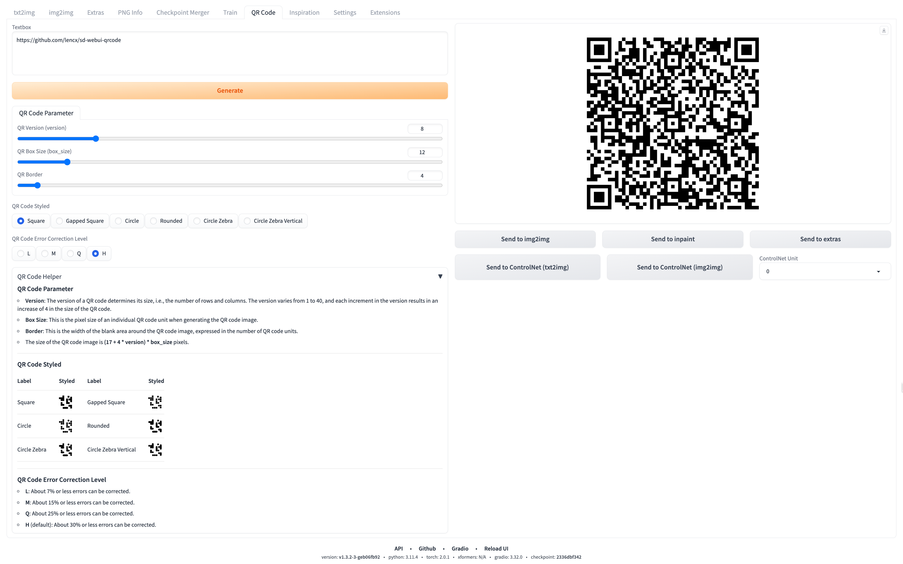

# QR Code Generator

Extension for AUTOMATIC1111's [Stable Diffusion web UI](https://github.com/AUTOMATIC1111/stable-diffusion-webui).

## Usage

1. Begin by installing the [Stable Diffusion web UI](https://github.com/AUTOMATIC1111/stable-diffusion-webui).
2. Once installation is complete, navigate to the `Extensions` tab.
3. Within the `Extensions` tab, locate and open the `Install from URL` sub-tab.
4. In the provided field, input the following URL for the extension's Git repository: `https://github.com/lencx/sd-webui-qrcode.git`.
5. Click on the `Install` button. Post-installation, a message will appear stating, "Installed into `~/stable-diffusion-webui/extensions/sd-webui-qrcode`. Use the `Installed` tab to restart."
6. Navigate to the `Installed` tab and click on `Apply and restart UI` to initialize the changes.
7. For future upgrades, within the `Installed` tab, select the `Check for updates` button. Observe the `Update` column in the displayed table, and select the plugins that need an upgrade. To apply these updates, click on `Apply and restart UI`, finalizing the upgrade process.

## Sponsor

You can choose a way to support my open source work. Thank you.

## 国内用户

`AI 绘画技术交流群`：如果群二维码失效，可以关注公众号 「`浮之静`」，发送 `sd` 获取群邀请。

 
